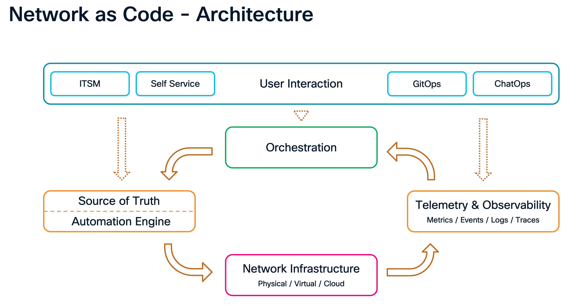
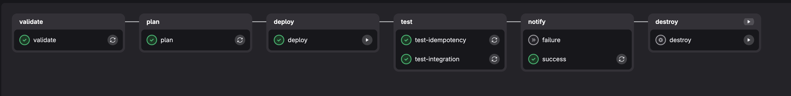

# Introduction

Cisco's modern controller platforms — ACI, SD-WAN Manager, Catalyst Center, and ISE — all expose rich APIs. The challenge is not whether automation is possible, but how to do it consistently, repeatably, and safely across domains. This lab answers that question using the **Net-as-Code** methodology.

## What Is Net-as-Code?

Net-as-Code is Cisco's opinionated approach to managing network infrastructure using Infrastructure as Code (IaC) principles. It is built on top of **HashiCorp Terraform** and a set of purpose-built Terraform modules — one for each controller domain:

| Module | Controller | Terraform Registry |
|---|---|---|
| `nac-aci` | Cisco ACI (APIC) | `netascode/nac-aci/aci` |
| `nac-sdwan` | Cisco SD-WAN | `netascode/nac-sdwan/sdwan` |
| `nac-catalystcenter` | Catalyst Center | `netascode/nac-catalystcenter/catalystcenter` |
| `nac-ise` | Cisco ISE | `netascode/nac-ise/ise` |

Each module accepts **YAML data files** as its only input. You describe *what* you want the network to look like; the module handles *how* to get there via the provider API.



## The Data / Logic Separation

The central idea is a clean split between **data** and **execution logic**:

- **Data** — human-readable YAML files that describe the desired state of the network. These are the files you edit when you want to make a change.
- **Logic** — the Terraform module code. This is maintained by Cisco and is consumed as a versioned dependency. You do not modify it.

This separation means that network engineers can manage their infrastructure by editing YAML files, without needing to learn the Terraform provider schema or write HCL.

### Example: Catalyst Center as Code

**Without data/logic separation** — you write Terraform resource blocks directly:

```hcl
resource "catalystcenter_area" "example" {
  name        = "Area1"
  parent_name = "Global"
}
```

**With data/logic separation** — you write a YAML data file:

```yaml
# sites.nac.yaml
catalyst_center:
  sites:
    areas:
      - name: Area1
        parent_name: Global
```

And a minimal `main.tf` that points the module at your YAML files:

```terraform-hcl
module "catalyst_center" {
  source  = "netascode/nac-catalystcenter/catalystcenter"
  version = "0.3.0"

  yaml_directories = ["data/"]
}
```

To add a second area, you add one entry to the YAML file and run `terraform apply`. You never touch `main.tf`.

## The Net-as-Code Workflow

Every domain in this lab follows the same five-step workflow:

```
  1. Validate    →  Lint YAML, run schema checks (nac-validate)
  2. Plan        →  terraform plan  (show what will change)
  3. Deploy      →  terraform apply  (apply changes to the controller)
  4. Test        →  Post-change compliance checks (nac-test)
  5. Notify      →  Send Webex notification
```

!!! note
    Some of the repositories may have an additional `destroy` step to clean up the resources after the test is complete. For production environments, it is recommended to modify the `*.nac.yaml` files to remove the resources and trigger the pipeline. The apply process will in-turn trigger the destroy process to clean up the resources.



Steps 1 through 5 are automated in a CI/CD pipeline (Jenkins or GitLab CI) triggered by a Git push. This means a network change goes through the same pull-request and pipeline gates as a software change.

## Repository Structure

Each domain repository in this lab follows the same layout:

```
<domain>-repo/
├── main.tf                  # Terraform entry point — do not modify
├── data/
│   └── *.nac.yaml           # Your data model files — edit these
├── defaults/                # Default values for the module
├── schemas/                 # JSON Schema files for YAML validation
├── validation/              # pytest-based semantic validation tests
├── .gitlab-ci.yml           # CI/CD pipeline definition
└── README.md
```

!!! tip "Key Insight"
    In day-to-day operations you only touch files inside `data/`. Everything else is infrastructure that the pipeline uses automatically.

## The Four Domain Modules in This Lab

### ACI as Code

Manages the full ACI policy model: tenants, VRFs, Bridge Domains, EPGs, contracts, L3Outs, access policies, and node/interface policies. Data files describe the ACI object model in YAML; the `nac-aci` module translates them to APIC REST API calls via the Terraform ACI provider.

### SD-WAN as Code

Manages SD-WAN feature templates, device templates, and policies. Data files describe VPN configurations, interface templates, and tunnel settings; the `nac-sdwan` module pushes them to SD-WAN Manager.

### Catalyst Center as Code

Manages SDA site hierarchy, IP pools, network settings, fabric provisioning (fabric sites, border/edge roles, L3 VNs, anycast gateways), and device assignments. The `nac-catalystcenter` module communicates with Catalyst Center's Intent API.

### ISE as Code

Manages TrustSec Security Groups (SGTs), Security Group ACLs (SGACLs), the policy matrix, network access policy sets, and network resources (network devices, network device groups). The `nac-ise` module communicates with ISE's ERS and OpenAPI endpoints.

## What You Will Build

By the end of this lab, you will have configured an end-to-end multi-domain policy:

```
  [ACI Fabric]              [Campus SDA]              [WAN]
  PROD Tenant               Bld A — Fabric A           SD-WAN VPN30
  BD-Servers / BD-Web  ←→  EmployeesPool / Servers ←→  cEdge-01/02/03
  L3OUT-SDWAN-PROD          Bld B — Fabric B
                            IoT Pool / Cameras

  [ISE TrustSec]
  SGT: IT_Admin=40  Servers=20  Cameras=30
  Policy: IT_Admin→Servers: PERMIT_ANY
          IT_Admin→Cameras: PERMIT_CAMERA_STREAM
          Default: LTRXAR_DENY_IP_LOG
```

All of this is driven from YAML data files checked into Git, deployed through a CI/CD pipeline, and enforced by post-change compliance checks.
