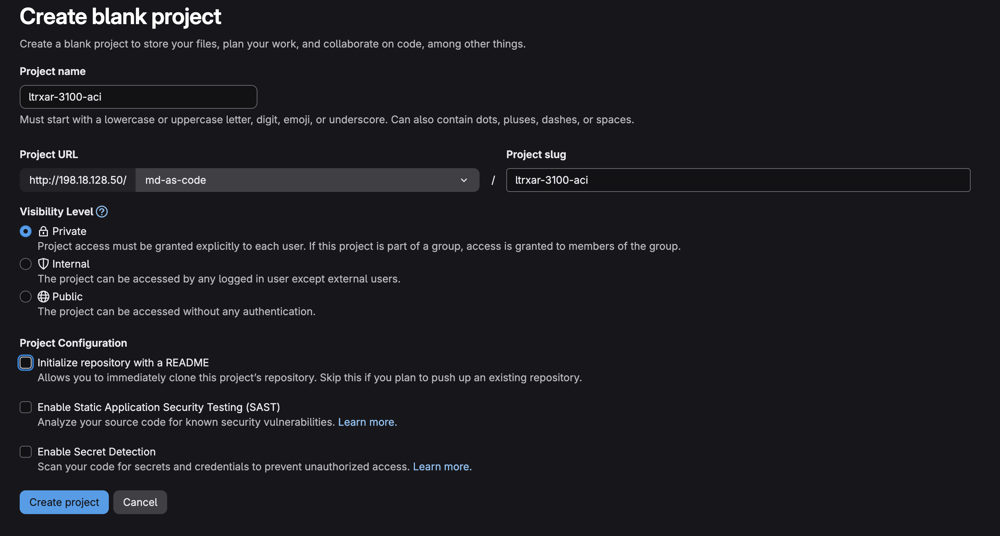
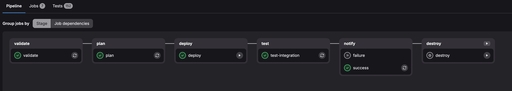
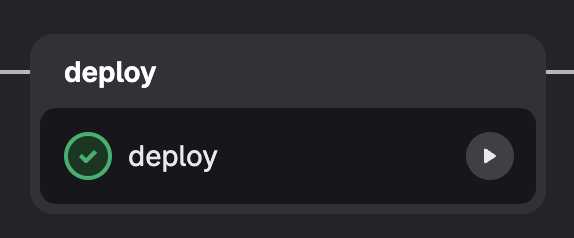

# Lab 1 — ACI as Code

In this lab you will use the **ACI as Code** solution to configure an ACI fabric. You will explore the YAML data model, understand how it maps to ACI objects, and deploy the configuration to the APIC simulator through a GitLab CI/CD pipeline.

> **Note:** The APIC simulator has no data plane — BGP peers configured in this lab will show as `Idle`. This is expected behavior and does not affect the automation exercises.

## Lab Objectives

After completing this lab, you will be able to:

- Describe the ACI as Code data model structure
- Understand how YAML files map to ACI policy objects
- Explain how the `nac-aci` Terraform module translates YAML to APIC REST API calls
- Push code to a GitLab repository and trigger a CI/CD pipeline
- Verify changes in the APIC GUI

## Repository Structure

```
ltrxar-3100-aci/
├── main.tf                        # Terraform entry point
├── data/
│   ├── access_policies.nac.yaml   # VLAN pools, domains, AAEPs, interface policies
│   ├── node_101.nac.yaml          # Leaf 101 interface assignments
│   ├── node_102.nac.yaml          # Leaf 102 interface assignments
│   ├── node_policies.nac.yaml     # Node registration (serial numbers, OOB IPs)
│   ├── tenant_PROD.nac.yaml       # Production tenant (VRF, BDs, EPGs, L3Out)
│   └── tenant_SVCS.nac.yaml       # Services tenant (VRF, BDs, EPGs, L3Out)
├── defaults/                      # Default values for the nac-aci module
├── schemas/                       # JSON Schema for YAML validation
├── templates/                     # Jinja2 test templates for post-deploy checks
├── validation/                    # pytest-based semantic tests
└── .gitlab-ci.yml                 # CI/CD pipeline definition
```

## Step 1: Connect to the Windows Workstation

Using the **Instructor-Led Lab Assistant**, establish a VPN connection to your assigned POD.

Open a Remote Desktop Protocol (RDP) session to the Windows VM:

- **IP:** `198.18.133.10`
- **Username:** `admin`
- **Password:** `C1sco12345`

Once connected, start **Visual Studio Code** from the taskbar or Start menu.

Open a new terminal: **Terminal → New Terminal**.


## Step 2: Clone the Repository

Clone the ACI as Code repository from GitHub:

```bash
git clone https://github.com/cisco-docs/ltrxar-3100-aci.git
cd ltrxar-3100-aci
```

Open the folder in VS Code: **File → Open Folder** and select `ltrxar-3100-aci`.

On the **Workspace Trust** dialog, select **Yes, I trust the authors**.


## Step 3: Explore the Terraform Entry Point

Open `main.tf`. This is the only Terraform file in the repository — you will not need to modify it.

```hcl
terraform {
  required_providers {
    aci = {
      source = "CiscoDevNet/aci"
    }
  }
  backend "http" {}
}

provider "aci" {}

module "aci" {
  source  = "netascode/nac-aci/aci"
  version = "1.1.0"

  yaml_directories = ["data"]

  manage_access_policies    = true
  manage_fabric_policies    = false
  manage_pod_policies       = false
  manage_node_policies      = true
  manage_interface_policies = true
  manage_tenants            = true

  write_default_values_file = "defaults.yaml"
}
```

**Key observations:**
- `yaml_directories = ["data"]` — the module reads all `*.nac.yaml` files from the `data/` directory
- Boolean flags (`manage_access_policies`, `manage_tenants`, etc.) control which parts of the ACI policy model Terraform owns. Setting a flag to `false` means Terraform will not touch those objects
- `write_default_values_file = "defaults.yaml"` — after apply, the module writes a `defaults.yaml` file showing all default values used
- `backend "http" {}` — Terraform state is stored in GitLab (configured automatically by the pipeline)

## Step 4: Explore the Data Model

### Access Policies (`access_policies.nac.yaml`)

Open `data/access_policies.nac.yaml`. This file configures ACI's access policy layer: VLAN pools, physical domains, routed domains, AAEPs, and interface policies.

```yaml
apic:
  access_policies:
    infra_vlan: 4

    vlan_pools:
      - name: STATIC1
        ranges:
          - from: 100
            to: 200
      - name: ROUTED1
        ranges:
          - from: 3000
            to: 3099

    physical_domains:
      - name: PHYSICAL1
        vlan_pool: STATIC1

    routed_domains:
      - name: ROUTED1
        vlan_pool: ROUTED1

    aaeps:
      - name: AAEP1
        physical_domains:
          - PHYSICAL1
        routed_domains:
          - ROUTED1

    interface_policies:
      cdp_policies:
        - name: CDP-ENABLED
          admin_state: true
      lldp_policies:
        - name: LLDP-ENABLED
          admin_rx_state: true
          admin_tx_state: true
      link_level_policies:
        - name: 10G
          speed: 10G
          auto: true
```

**Key points:**
- The YAML hierarchy mirrors the ACI object model. `apic.access_policies.vlan_pools` maps directly to APIC's `infraVlanPool` objects
- Policy references (e.g., `vlan_pool: STATIC1` under `physical_domains`) are resolved by name — no object IDs or DNs required
- Adding a new VLAN pool is as simple as adding a new list entry under `vlan_pools`

### Tenant Configuration (`tenant_PROD.nac.yaml`)

Open `data/tenant_PROD.nac.yaml`. This file defines the `PROD` tenant with its full policy model.

```yaml
apic:
  tenants:
    - name: PROD

      vrfs:
        - name: PROD

      bridge_domains:
        - name: BD-Servers
          vrf: PROD
          unicast_routing: true
          subnets:
            - ip: 192.168.10.1/24
              public: true
          l3outs:
            - L3OUT-SDWAN-PROD

      contracts:
        - name: CT-PROD-PERMIT-ANY
          scope: context
          subjects:
            - name: SUBJ-PERMIT-ANY
              filters:
                - filter: default
                  action: permit

      application_profiles:
        - name: PROD
          endpoint_groups:
            - name: EPG-Servers
              bridge_domain: BD-Servers
              contracts:
                consumers:
                  - CT-PROD-PERMIT-ANY
                providers:
                  - CT-PROD-PERMIT-ANY
              static_ports:
                - node_id: 101
                  port: 3
                  vlan: 30
```

**Key points:**
- The L3Out `L3OUT-SDWAN-PROD` is also defined in this file — it configures an eBGP peering on LEAF102 eth1/1 (VLAN 3010, `10.100.10.1/30`) toward the SD-WAN edge (`10.100.10.2`, AS 65200)
- This is the ACI side of the multi-domain integration you will complete in Lab 5
- Contract references within EPGs use names only — no MOPaths or DNs

### Node Policies (`node_policies.nac.yaml`)

Open `data/node_policies.nac.yaml`. This file registers the two ACI leaf switches.

```yaml
apic:
  node_policies:
    nodes:
      - id: 101
        pod: 1
        role: leaf
        serial_number: TEP-1-101
        name: LEAF101
        oob_address: 10.51.77.94/24
        oob_gateway: 10.51.77.254

      - id: 102
        pod: 1
        role: leaf
        serial_number: TEP-1-102
        name: LEAF102
        oob_address: 10.51.77.95/24
        oob_gateway: 10.51.77.254
```

## Step 5: Create a GitLab Project

Open a browser and navigate to the GitLab instance: `http://198.18.128.50`

Log in with `labuser` / `C1sco12345`.

Create a new project:

1. Click **New project → Create blank project**
2. Set the **Project name** to `ltrxar-3100-aci`
3. Set the **Namespace** to `md-as-code` (select from the dropdown)
4. Set **Visibility level** to **Private**
5. **Uncheck** "Initialize repository with a README"
6. Click **Create project**



The project URL will be: `http://198.18.128.50/md-as-code/ltrxar-3100-aci`

> **Note:** CI/CD variables (ACI credentials, GitLab token) are pre-configured at the **group level** (`md-as-code`) in this lab environment. You do not need to set them manually for individual projects.

## Step 6: Push to GitLab

Back in the VS Code terminal, add the GitLab instance as a second remote and push the repository:

```bash
git remote add gitlab http://198.18.128.50/md-as-code/ltrxar-3100-aci.git
git push gitlab master
```

When prompted for credentials, enter:
- **Username:** `labuser`
- **Password:** `C1sco12345`

```
Enumerating objects: 42, done.
Counting objects: 100% (42/42), done.
Writing objects: 100% (42/42), 18.3 KiB | 1.43 MiB/s, done.
To http://198.18.128.50/md-as-code/ltrxar-3100-aci.git
 * [new branch]      master -> master
```

## Step 7: Monitor the Pipeline

In the GitLab browser, navigate to your project and click **Build → Pipelines**.

The pipeline starts automatically when code is pushed to the `master` branch. You will see the stages running in sequence:

| Stage | Job | What it does |
|---|---|---|
| **validate** | `validate` | Checks Terraform formatting and validates YAML against JSON Schema |
| **plan** | `plan` | Runs `terraform plan` and posts a summary comment to the pipeline |
| **deploy** | `deploy` | Applies the Terraform plan — **requires manual trigger** |
| **test** | `test-integration` | Runs post-deploy compliance checks against the APIC |
| **notify** | `success` / `failure` | Sends a Webex notification with the pipeline result |



Wait for the **validate** and **plan** stages to complete (green checkmarks). Click the **plan** job to review the Terraform plan output — you should see 47 resources to be added.

## Step 8: Trigger the Deploy

The `deploy` job is set to `when: manual` — it requires a deliberate click to prevent accidental changes.

In the pipeline view, click the **play button (▶)** next to the `deploy` job.



The job will run `terraform apply -auto-approve` using the plan artifact from the previous stage. When complete, the **test-integration** stage runs automatically to verify the deployed state against the APIC.

> **Expected output:**
> ```
> Apply complete! Resources: 47 added, 0 changed, 0 destroyed.
> ```

## Step 9: Verify in the APIC GUI

Open a browser and navigate to the APIC simulator: `https://198.18.133.200`

Log in with `admin` / `C1sco12345`.

**Verify tenant PROD:**

1. Navigate to **Tenants → PROD → Networking → VRFs**. Confirm `PROD` VRF exists.
2. Navigate to **Tenants → PROD → Networking → Bridge Domains**. Confirm `BD-Servers` and `BD-Web` exist with their subnets.
3. Navigate to **Tenants → PROD → Application Profiles → PROD → Application EPGs**. Confirm `EPG-Servers` and `EPG-Web` exist.
4. Navigate to **Tenants → PROD → Networking → L3Outs → L3OUT-SDWAN-PROD**. Confirm the L3Out exists with the BGP peer on LEAF102.

> **Expected:** The BGP peer `10.100.10.2` will show as `Idle`. This is correct — the SD-WAN edge is not yet connected. You will complete the BGP adjacency in Lab 5.

**Verify access policies:**

Navigate to **Fabric → Access Policies**. Confirm:
- VLAN pools `STATIC1` and `ROUTED1` exist
- Physical domain `PHYSICAL1` and routed domain `ROUTED1` exist
- AAEP `AAEP1` exists and references the correct domains

## Understanding the CI/CD Pipeline

Open `.gitlab-ci.yml` at the root of the repository. This file defines all six pipeline stages.

```yaml
image:
  name: danischm/nac:latest
  pull_policy: if-not-present

stages:
  - validate
  - plan
  - deploy
  - test
  - notify
  - destroy

variables:
  TF_HTTP_ADDRESS: "${GITLAB_API_URL}/projects/${CI_PROJECT_ID}/terraform/state/tfstate"
```

**Key design decisions:**

**Docker image (`danischm/nac:latest`)** — A single container image pre-packages Terraform, Python, `nac-validate`, `nac-test`, yamllint, and all provider dependencies. Every job runs inside this container, ensuring a consistent, reproducible environment.

**Terraform HTTP backend** — The `TF_HTTP_ADDRESS` variable points to GitLab's built-in Terraform state storage API. State is stored per-project, per-branch, and is locked during `plan` and `apply` to prevent concurrent runs.

**`validate` stage** — Runs two checks before any cloud API is called:
```yaml
validate:
  script:
    - terraform fmt -check          # Ensures consistent YAML/HCL formatting
    - nac-validate ./data/ --rules ./validation/rules  # Schema validation
```
`nac-validate` checks your YAML data files against JSON Schema, catching unknown keys, wrong data types, and missing required fields. This provides fast feedback without touching the APIC.

**`plan` stage** — Runs `terraform init` (downloading the `nac-aci` module from the registry) and `terraform plan`. The plan artifact is saved and a summary comment is posted to the GitLab pipeline:
```yaml
plan:
  script:
    - terraform init -upgrade -input=false
    - terraform plan -out=plan.tfplan -input=false
    - terraform show -no-color plan.tfplan > plan.txt
```

**`deploy` stage (manual)** — Applies the saved plan artifact. The `when: manual` gate means a human must approve before any change reaches the APIC:
```yaml
deploy:
  when: manual
  script:
    - terraform apply -input=false -auto-approve plan.tfplan
```

**`test-integration` stage** — After deployment, `nac-test` renders Jinja2 test templates against data from the APIC and produces xUnit XML reports:
```yaml
test-integration:
  script:
    - nac-test -d ./data -d ./defaults/apic_defaults.yaml
        -t ./templates/apic/test -i tenants -i access_policies
```

**`notify` stage** — Sends a Webex Teams message with the pipeline result (success or failure), including a link to the pipeline and a summary of changes.

## Make a Change (Day-2 Operation)

Now you will simulate a day-2 change: adding a new endpoint group to the `PROD` application profile.

Open `data/tenant_PROD.nac.yaml` and add a new EPG under the `PROD` application profile:

```yaml
      application_profiles:
        - name: PROD
          endpoint_groups:
            - name: EPG-Servers       # existing
              ...
            - name: EPG-Web           # existing
              ...
            - name: EPG-Mgmt          # ADD THIS
              bridge_domain: BD-Web
              physical_domains:
                - PHYSICAL1
              contracts:
                consumers:
                  - CT-PROD-PERMIT-ANY
                providers:
                  - CT-PROD-PERMIT-ANY
```

Save the file, commit, and push:

```bash
git add data/tenant_PROD.nac.yaml
git commit -m "Add EPG-Mgmt to PROD application profile"
git push gitlab master
```

A new pipeline run starts automatically. The **plan** stage will show exactly one resource to add (`EPG-Mgmt`) without touching any existing objects. Trigger the **deploy** job and verify the new EPG appears in the APIC GUI under **Tenants → PROD → Application Profiles → PROD**.

## Summary

In this lab you:

- Cloned the ACI as Code repository from GitHub and explored the YAML data model
- Understood how `*.nac.yaml` files map to ACI policy objects (VLAN pools, domains, tenants, EPGs, L3Outs)
- Created a GitLab project and pushed the repository to the lab CI/CD environment
- Observed the pipeline run through validate → plan → deploy → test stages
- Verified the deployed configuration in the APIC GUI
- Made a day-2 change and re-deployed through the pipeline

**Continue to [Lab 2 — SD-WAN as Code](lab2_sdwan.md).**
