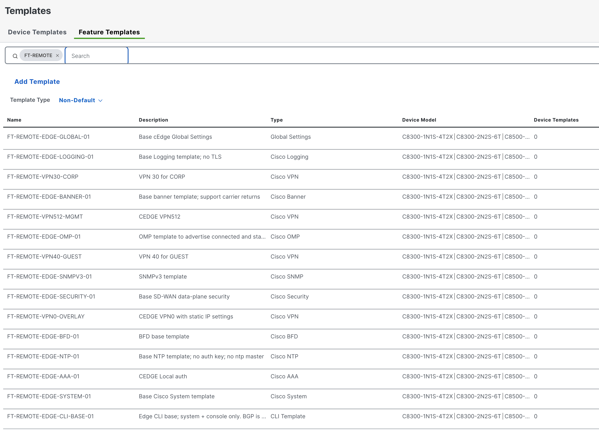

# Lab 2 — SD-WAN as Code

In this lab you will use the **SD-WAN as Code** Terraform module to deploy feature templates to SD-WAN Manager. Feature templates are the building blocks for SD-WAN device templates — they define VPN configurations, interface settings, tunnel policies, and SGT propagation settings.

## Lab Objectives

After completing this lab, you will be able to:

- Describe the SD-WAN as Code data model and how feature templates are represented in YAML
- Understand the role of template variables in SD-WAN automation
- Push the repository to GitLab and trigger the CI/CD pipeline
- Verify deployed feature templates in the SD-WAN Manager GUI

## Repository Structure

```
ltrxar-3100-sdwan/
├── main.tf                              # Terraform entry point
├── data/
│   └── edge_feature_templates.nac.yaml  # VPN and interface feature templates
├── defaults/                            # Default values for the module
├── schemas/                             # JSON Schema for YAML validation
├── templates/                           # Jinja2 test templates for post-deploy checks
├── validation/                          # pytest-based semantic tests
└── .gitlab-ci.yml                       # CI/CD pipeline definition
```

## Step 1: Connect to the Windows Workstation

If you have closed the RDP session from Lab 1, reconnect:

- **IP:** `198.18.133.10`
- **Username:** `admin`
- **Password:** `C1sco12345`

Open **Visual Studio Code** and open a new terminal: **Terminal → New Terminal**.

## Step 2: Clone the Repository

Clone the SD-WAN as Code repository from GitHub:

```bash
git clone https://github.com/cisco-docs/ltrxar-3100-sdwan.git
cd ltrxar-3100-sdwan
```

Open the folder in VS Code: **File → Open Folder** → select `ltrxar-3100-sdwan`. Trust the workspace when prompted.

## Step 3: Explore the Terraform Entry Point

Open `main.tf`:

```hcl
terraform {
  required_version = ">= 1.0"
  required_providers {
    sdwan = {
      source  = "CiscoDevNet/sdwan"
      version = "~> 0.11.0"
    }
  }
  backend "http" {
    skip_cert_verification = true
  }
}

module "sdwan" {
  source = "github.com/netascode/terraform-sdwan-nac-sdwan"

  yaml_directories = ["data/"]

  write_default_values_file = "defaults.yaml"
}
```

**Key observations:**
- The SD-WAN module is sourced directly from GitHub rather than the Terraform registry
- `skip_cert_verification = true` is required because SD-WAN Manager uses a self-signed certificate in the lab environment
- The same `yaml_directories` pattern is used across all Net-as-Code modules — the data model drives everything
- `backend "http" {}` — Terraform state is stored in GitLab (configured automatically by the pipeline)

## Step 4: Explore the Data Model

Open `data/edge_feature_templates.nac.yaml`. This file defines feature templates for the SD-WAN edges in the lab.

### VPN Feature Templates

VPN feature templates define the routing and forwarding table for each traffic segment. The lab uses four VPN IDs:

| VPN | Name | Purpose |
|---|---|---|
| 0 | VPN0 | Overlay transport (TLOC interfaces) |
| 30 | CORP | Production traffic (connects to ACI PROD tenant) |
| 40 | GUEST | Guest traffic |
| 512 | OOB | Out-of-band management |

```yaml
sdwan:
  edge_feature_templates:

    vpn_templates:
      - name: FT-REMOTE-VPN30-CORP
        description: VPN 30 for CORP
        vpn_name: CORP
        vpn_id: 30
        omp_advertise_ipv4_routes:
          - protocol: connected
          - protocol: static
          - protocol: bgp
        ipv4_static_routes:
          - prefix_variable: vpn30_default_route_prefix
            optional: false
            next_hops:
              - address_variable: vpn30_default_route_next_hop
                distance_variable: vpn30_default_route_distance
```

**What are template variables?**

Values like `vpn30_default_route_prefix` are *variable references*, not actual IP addresses. In SD-WAN, feature templates can contain parameterized values that are resolved per-device when the template is attached to a device.

- A key ending in `_variable` specifies the name of a device-level variable (not the value itself)
- Device-specific values are supplied at template attachment time, either manually or via automation

This allows the same template to be reused across multiple sites with different addressing.

### Ethernet Interface Feature Templates

The lab defines TLOC interface templates — one for the public internet transport and one for the private MPLS transport:

```yaml
    ethernet_interface_templates:
      - name: FT-TLOC1-PUBLIC-REMOTE-VPN0
        description: CEDGE TLOC1 with static IP Settings, NAT enabled
        interface_name_variable: vpn0_tloc01_if_name
        ipv4_address_variable: vpn0_tloc01_if_ipv4_address
        ipv4_nat: true
        ipv4_nat_type: interface
        tunnel_interface:
          color_variable: vpn0_tloc01_tunnel_color
          ipsec_encapsulation: true
          propagate_sgt: true
          allow_service_icmp: true
          allow_service_dns: true
          allow_service_dhcp: true

      - name: FT-TLOC2-PRIVATE-REMOTE-VPN0
        description: CEDGE TLOC2 with static IP Settings
        interface_name_variable: vpn0_tloc02_if_name
        ipv4_address_variable: vpn0_tloc02_if_ipv4_address
        ipv4_nat: false
        tunnel_interface:
          color_variable: vpn0_tloc02_tunnel_color
          ipsec_encapsulation: true
          propagate_sgt: true
```

> **Important:** `propagate_sgt: true` enables TrustSec SGT propagation across the SD-WAN overlay. This is the SD-WAN side of the end-to-end SGT enforcement you will configure in ISE (Lab 4) and validate in the multi-domain integration (Lab 5).

## Step 5: Create a GitLab Project

Open a browser and navigate to the GitLab instance: `http://198.18.128.50`

Log in with `labuser` / `C1sco12345`.

Create a new project:

1. Click **New project → Create blank project**
2. Set the **Project name** to `ltrxar-3100-sdwan`
3. Set the **Namespace** to `md-as-code`
4. Set **Visibility level** to **Private**
5. **Uncheck** "Initialize repository with a README"
6. Click **Create project**

> **Note:** SD-WAN Manager credentials (`SDWAN_URL`, `SDWAN_USERNAME`, `SDWAN_PASSWORD`) are pre-configured at the `md-as-code` group level. No per-project variable setup is required.

## Step 6: Push to GitLab

In the VS Code terminal:

```bash
git remote add gitlab http://198.18.128.50/md-as-code/ltrxar-3100-sdwan.git
git push gitlab master
```

When prompted, enter `labuser` / `C1sco12345`.

## Step 7: Monitor the Pipeline

In GitLab, navigate to **Build → Pipelines** in your `ltrxar-3100-sdwan` project.

The pipeline runs through the same stages as Lab 1:

| Stage | Job | What it does |
|---|---|---|
| **validate** | `validate` | Checks HCL formatting + validates YAML against SD-WAN JSON Schema |
| **plan** | `plan` | `terraform plan` — shows all feature templates to be created |
| **deploy** | `deploy` | **Manual trigger** — `terraform apply` pushes templates to SD-WAN Manager |
| **test** | `test-integration` | `nac-test` verifies deployed templates against SD-WAN Manager API |
| **test** | `test-idempotency` | `terraform plan -detailed-exitcode` — verifies no drift after apply |
| **notify** | `success` / `failure` | Sends Webex notification |

Wait for **validate** and **plan** to complete. Review the plan output to see all feature templates that will be created.

## Step 8: Trigger the Deploy and Verify

Click the **play button (▶)** next to the `deploy` job. When complete, the **test** stage runs automatically.

**Verify in SD-WAN Manager:**

Open a browser and navigate to: `https://198.18.185.11`

Log in with `admin` / `C1sco12345`.

Navigate to **Configuration → Templates → Feature Templates**.

Verify the following feature templates have been created:

| Template Name | Type |
|---|---|
| `FT-REMOTE-VPN30-CORP` | Cisco VPN |
| `FT-REMOTE-VPN40-GUEST` | Cisco VPN |
| `FT-REMOTE-VPN0-OVERLAY` | Cisco VPN |
| `FT-REMOTE-VPN512-MGMT` | Cisco VPN |
| `FT-TLOC1-PUBLIC-REMOTE-VPN0` | Cisco VPN Interface |
| `FT-TLOC2-PRIVATE-REMOTE-VPN0` | Cisco VPN Interface |

Click on `FT-REMOTE-VPN30-CORP` and review the VPN ID, OMP route advertisement settings, and static route variables.



## Understanding the CI/CD Pipeline

Open `.gitlab-ci.yml`. The SD-WAN pipeline follows the same structure as Lab 1 with one notable addition: the **idempotency test**.

```yaml
image:
  name: danischm/nac:latest
  pull_policy: if-not-present

stages:
  - validate
  - plan
  - deploy
  - test
  - notify
  - destroy

variables:
  SDWAN_USERNAME: ...
  SDWAN_PASSWORD: ...
  SDWAN_URL: ...
  TF_HTTP_ADDRESS: "${GITLAB_API_URL}/projects/${CI_PROJECT_ID}/terraform/state/tfstate"
```

**Idempotency test** — After deployment, the pipeline runs a second `terraform plan` to verify that the deployed state exactly matches the desired state:

```yaml
test-idempotency:
  stage: test
  resource_group: sdwan
  script:
    - terraform init -input=false
    - terraform plan -input=false -detailed-exitcode
```

The `-detailed-exitcode` flag causes `terraform plan` to exit with code `2` if it finds any differences between desired and actual state, which would fail the job. An exit code of `0` means "no changes" — confirming the deployment was fully successful with no drift.

This is a best-practice pattern: deploy, then immediately verify the controller accepted exactly what you sent. SD-WAN Manager in particular can sometimes silently normalize values, and the idempotency check catches those cases.

**`resource_group: sdwan`** — Both the `plan` and `deploy` jobs share this resource group, ensuring that only one Terraform operation against SD-WAN Manager runs at a time. This prevents state file locking conflicts when multiple pipeline runs are active.

## Summary

In this lab you:

- Cloned the SD-WAN as Code repository and explored VPN and interface feature templates
- Understood how template variables enable device-specific parameterization
- Created a GitLab project and pushed the repository to trigger the CI/CD pipeline
- Verified feature templates were deployed in SD-WAN Manager
- Learned about the idempotency test pattern for verifying deployment accuracy

**Continue to [Lab 3 — Catalyst Center as Code](lab3_catc.md).**
