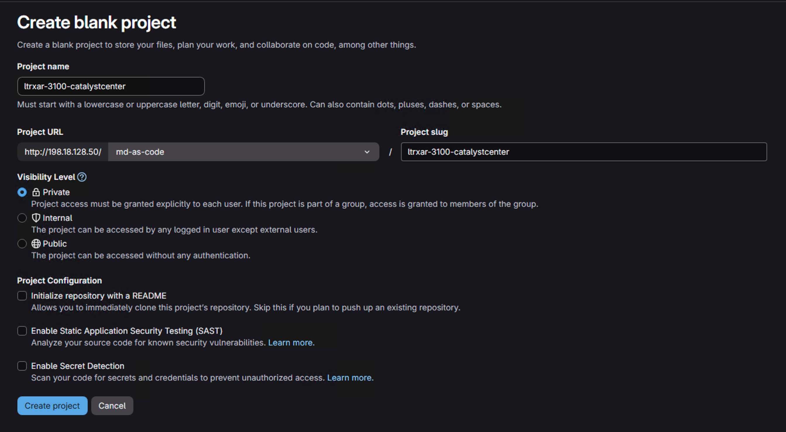
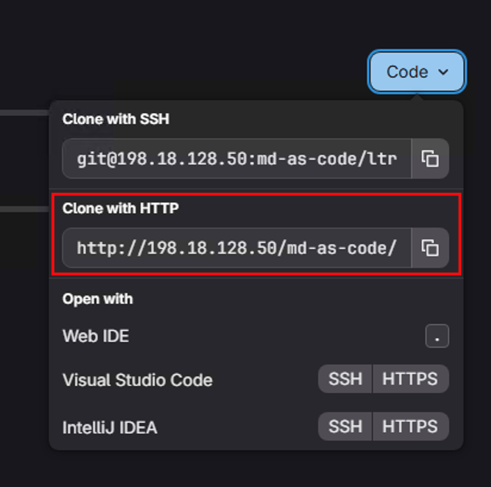
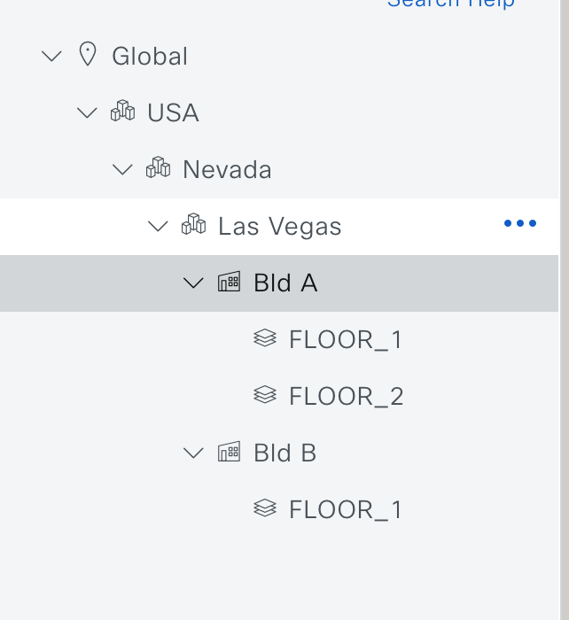

# Lab 3 — Catalyst Center as Code

In this lab you will use the **Catalyst Center as Code** Terraform module to provision a full SDA (Software-Defined Access) fabric. You will configure the site hierarchy, IP pools, AAA settings, fabric sites, L3 Virtual Networks, anycast gateways, and assign devices to fabric roles — all from YAML data files deployed through a GitLab CI/CD pipeline.

## Lab Objectives

After completing this lab, you will be able to:

- Navigate the Catalyst Center as Code data model for sites, network settings, fabric, and devices
- Understand the multi-fabric pattern (two distinct fabric sites managed by one Catalyst Center)
- Push the repository to GitLab and trigger the CI/CD pipeline
- Verify SDA fabric provisioning in the Catalyst Center GUI

## Lab Topology

This lab provisions two SDA fabrics managed by a single Catalyst Center instance:

| Fabric | Site | Devices | L3 VN | IP Pools |
|---|---|---|---|---|
| **Fabric A** | `Global/USA/Nevada/Las Vegas/Bld A` | BORDER, SDA-EDGE-01, SDA-EDGE-02 | Campus | EmployeesPool, ServersPool |
| **Fabric B** | `Global/USA/Nevada/Las Vegas/Bld B` | FIAB (all roles) | IoT | IoTPool |

Both fabrics share city-level AAA settings (ISE 3.3) and draw IP pool reservations from the same parent `Overlay` pool.

!!! warning "Housekeeping"
    Depending on the lab environment, there might be a case that your Catalyst 9000 switches might had some configuration that might prevent you automation pipeline to kick in due to order of operations. These configurations may not impact directly for this lab, but if you like to make sure, log into all the switches and issue following commands:

    | Device | Command |
    | --- | --- |
    | FIAB | `no aaa accounting update` <br> `default interface GigabitEthernet1/0/24` |
    | BORDER | `no aaa accounting update` |
    | EDGE01 | `no aaa accounting update` |
    | EDGE02 | `no aaa accounting update` |


## Repository Structure

```
ltrxar-3100-catalystcenter/
├── main.tf                         # Terraform entry point
├── data/
│   ├── sites.nac.yaml              # Site hierarchy (areas, buildings, floors)
│   ├── network_settings.nac.yaml   # IP pools, AAA settings, telemetry
│   └── templates/                  # Day-N CLI templates
├── backup_data/                    # Multi-domain files (used in Lab 5)
│   ├── multidomain_fabric.nac.yaml # Fabric sites, L3 VNs, anycast gateways, L3 handoffs
│   └── multidomain_devices.nac.yaml# Device inventory and fabric role assignments
├── defaults/                       # Default values for the module
├── schemas/                        # JSON Schema for YAML validation
├── templates/                      # Jinja2 test templates for post-deploy checks
├── validation/                     # pytest-based semantic tests
└── .gitlab-ci.yml                  # CI/CD pipeline definition
```

**Note:** The `backup_data/` directory contains the fabric provisioning and device inventory files that will be activated in Lab 5 (Multi-Domain Integration). In this lab, you will only deploy the site hierarchy and network settings.

## Step 1: Connect to the Windows Workstation

If you have closed the RDP session, reconnect:

- **IP:** `198.18.133.10`
- **Username:** `admin`
- **Password:** `C1sco12345`

Open **Visual Studio Code** and open a new terminal: **Terminal → New Terminal**.

## Step 2: Clone the Repository

Clone the Catalyst Center as Code repository from GitHub:

```bash
git clone https://github.com/cisco-docs/ltrxar-3100-catalystcenter.git
cd ltrxar-3100-catalystcenter
```

Open the folder in VS Code: **File → Open Folder** → select `ltrxar-3100-catalystcenter`. Trust the workspace when prompted.

## Step 3: Explore the Terraform Entry Point

Open `main.tf`:

```hcl
terraform {
  required_providers {
    catalystcenter = {
      source  = "CiscoDevNet/catalystcenter"
      version = "0.4.7"
    }
  }
  backend "http" {}
}

provider "catalystcenter" {
  max_timeout = 600
}

module "catalyst_center" {
  source  = "netascode/nac-catalystcenter/catalystcenter"
  version = "0.3.0"

  yaml_directories      = ["data/"]
  templates_directories = ["data/templates/"]

  use_bulk_api = true
}
```

**Key observations:**
- `use_bulk_api = true` — enables Catalyst Center's bulk provisioning APIs, which significantly speeds up large deployments by batching API calls
- `max_timeout = 600` — Catalyst Center operations like fabric provisioning can take several minutes; a high timeout in the **provider block** prevents premature failures
- `backend "http" {}` — Terraform state is stored in GitLab (configured automatically by the pipeline)
- Provider credentials (`CC_URL`, `CC_USERNAME`, `CC_PASSWORD`) are injected by the pipeline as environment variables

## Step 4: Explore the Data Model

### Site Hierarchy (`sites.nac.yaml`)

Open `data/sites.nac.yaml`. This file defines the complete Catalyst Center site hierarchy from Global down to individual floors.

```yaml
catalyst_center:
  sites:
    areas:
      - name: Global
      - name: USA
        parent_name: Global
      - name: Nevada
        parent_name: Global/USA
      - name: Las Vegas
        parent_name: Global/USA/Nevada
        network_settings:
          aaa_servers: AAA_Settings
          telemetry: FABRIC_TELEMETRY
    buildings:
      - name: Bld A
        latitude: 36.1699
        longitude: -115.1398
        country: United States
        parent_name: Global/USA/Nevada/Las Vegas
        ip_pools_reservations:
          - EmployeesPool
          - ServersPool
      - name: Bld B
        latitude: 36.1699
        longitude: -115.1398
        country: United States
        parent_name: Global/USA/Nevada/Las Vegas
        ip_pools_reservations:
          - IoTPool
    floors:
      - name: FLOOR_1
        floor_number: 1
        parent_name: Global/USA/Nevada/Las Vegas/Bld A
```

**Key points:**
- `ip_pools_reservations` are defined at the **building level** — `EmployeesPool` and `ServersPool` are reserved for Bld A (Fabric A), and `IoTPool` is reserved for Bld B (Fabric B)
- `telemetry: FABRIC_TELEMETRY` at the Las Vegas level enables wired data collection and uses Catalyst Center as the network collector for both buildings
- Site paths use `/`-separated names (e.g., `Global/USA/Nevada/Las Vegas`) — these are used as references throughout all data files
- `aaa_servers: AAA_Settings` references the AAA server defined in `network_settings.nac.yaml`

### Network Settings (`network_settings.nac.yaml`)

Open `data/network_settings.nac.yaml`. This file defines global IP pools and AAA server settings.

```yaml
catalyst_center:
  network_settings:
    aaa_servers:
      - name: AAA_Settings
        client_and_endpoint_aaa:
          server_type: ISE
          protocol: RADIUS
          primary_ip: 198.18.133.30
          shared_secret: C1sco12345

    ip_pools:
      - name: Overlay
        ip_address_space: IPv4
        ip_pool_cidr: 192.168.0.0/16
        ip_pools_reservations:
          - name: EmployeesPool
            prefix_length: 24
            subnet: 192.168.100.0
            gateway: 192.168.100.1
            dns_servers:
              - 198.18.130.11
            dhcp_servers:
              - 198.18.130.11
          - name: ServersPool
            prefix_length: 24
            subnet: 192.168.110.0
            gateway: 192.168.110.1
            dns_servers:
              - 198.18.130.11
            dhcp_servers:
              - 198.18.130.11
          - name: IoTPool
            prefix_length: 24
            subnet: 192.168.200.0
            gateway: 192.168.200.1
            dns_servers:
              - 198.18.130.11
            dhcp_servers:
              - 198.18.130.11

    telemetry:
      - name: FABRIC_TELEMETRY
        wired_data_collection: true
        wireless_telemetry: false
        enable_netflow_collector_on_devices: false
        catalyst_center_as_network_collector: true
        catalyst_center_as_snmp_server: true
        catalyst_center_as_syslog_server: true
```

**Key points:**
- `Overlay` is the parent pool (`192.168.0.0/16`); the three child reservations are carved from it
- ISE (`198.18.133.30`) is configured as the RADIUS server for both client AAA (802.1X) and endpoint AAA (profiling) with the shared secret `C1sco12345`
- `FABRIC_TELEMETRY` enables wired data collection and configures Catalyst Center as the SNMP and syslog collector for fabric devices

### Fabric and Device Configuration

The fabric provisioning and device inventory configuration files (`multidomain_fabric.nac.yaml` and `multidomain_devices.nac.yaml`) are located in the `backup_data/` directory. These files configure the SDA fabric sites, L3 Virtual Networks, anycast gateways, border device L3 handoffs, and device fabric role assignments.

You will activate these files in **Lab 5 — Multi-Domain Integration** by moving them into the `data/` directory. For now, this lab focuses on the site hierarchy and network settings that form the foundation for the fabric deployment.

## Step 5: Create a GitLab Project

Open a browser and navigate to the GitLab instance: `http://198.18.128.50`

Log in with `labuser` / `C1sco12345`.

Create a new project:

1. Click **New project → Create blank project**
2. Set the **Project name** to `ltrxar-3100-catalystcenter`
3. Set the **Namespace** to `md-as-code`
4. Set **Visibility level** to **Private**
5. **Uncheck** "Initialize repository with a README"
6. Click **Create project**



Once the project is created, click on the `Code` button and copy the URL displayed under `Clone with HTTP` by clicking the `Copy URL` icon.



!!! note
    Catalyst Center credentials (`CC_URL`, `CC_USERNAME`, `CC_PASSWORD`) are pre-configured at the `md-as-code` group level.

## Step 6: Push to GitLab

Back in the VS Code terminal, first, lets check the remotes of the repository by issuing following command:

```bash
git remote -v
```

You should see the following output:

```bash
origin  https://github.com/cisco-docs/ltrxar-3100-catalystcenter.git (fetch)
origin  https://github.com/cisco-docs/ltrxar-3100-catalystcenter.git (push)
```
Now, add the GitLab instance as a second remote and push the repository:

```bash
git remote add gitlab <PROJECT_URL>
```
For example:

```bash
git remote add gitlab http://198.18.128.50/md-as-code/ltrxar-3100-catalystcenter.git
git push gitlab main
```

Your credentials from Lab 1 will be cached, however if prompted again, in the top search bar enter:
- **Username:** `labuser`
- **Password:** `C1sco12345`

**Expected output:**

You may see certificate warnings and a message about unencrypted HTTP. This is expected and can be ignored.

```console
fatal: Unencrypted HTTP is not supported for GitHub. Ensure the repository remote URL is using HTTPS.
warning: ----------------- SECURITY WARNING ----------------
warning: | TLS certificate verification has been disabled! |
warning: ---------------------------------------------------
warning: HTTPS connections may not be secure. See https://aka.ms/gcm/tlsverify for more information.
Enumerating objects: 703, done.
Counting objects: 100% (703/703), done.
Delta compression using up to 4 threads
Compressing objects: 100% (312/312), done.
Writing objects: 100% (703/703), 215.86 KiB | 11.36 MiB/s, done.
Total 703 (delta 368), reused 697 (delta 365), pack-reused 0 (from 0)
remote: Resolving deltas: 100% (368/368), done.
To http://198.18.128.50/md-as-code/ltrxar-3100-catalystcenter.git
 * [new branch]      main -> main
```

## Step 7: Monitor the Pipeline

In GitLab, navigate to **Build → Pipelines** in your `ltrxar-3100-catalystcenter` project.

The pipeline runs through the standard stages:

| Stage | Job | What it does |
|---|---|---|
| **validate** | `validate` | Checks HCL formatting + validates YAML against Catalyst Center JSON Schema |
| **plan** | `plan` | `terraform plan` — shows all site, fabric, and device resources to be created |
| **deploy** | `deploy` | **Manual trigger** — `terraform apply` pushes configuration to Catalyst Center |
| **test** | `test` | `nac-test` verifies deployed state against Catalyst Center API |
| **notify** | `success` / `failure` | Sends Webex notification |

!!! note
    The `plan` stage downloads the `nac-catalystcenter` module from the Terraform registry. This may take 2–3 minutes on the first run.

Wait for **validate** and **plan** to complete. Review the plan — you should see resources for the full site hierarchy, IP pools, fabric sites, VNs, anycast gateways, and device assignments.

## Step 8: Trigger the Deploy and Verify

Click the **play button (▶)** next to the `deploy` job.

The deploy job will take a few minutes to complete as Catalyst Center creates the site hierarchy and network settings:
1. Create the site hierarchy (areas, buildings, floors)
2. Configure IP pools and reservations
3. Configure AAA settings and telemetry profiles

Once the deploy job turns green, the **test** stage runs automatically.

**Verify in Catalyst Center:**

Open a browser and navigate to: `https://198.18.129.100`

Log in with `admin` / `C1sco12345`.

1. Navigate to **Design → Network Hierarchy**. Confirm `Bld A` and `Bld B` exist under `Global/USA/Nevada/Las Vegas`.
   
2. Navigate to **Design → Network Settings → IP Address Pools** for `Las Vegas` and each building in that site. Confirm `EmployeesPool`, `ServersPool`, and `IoTPool` are visible and correctly assigned to the buildings.

For this exercise, these are the primary items to verify. The more complex fabric provisioning and device inventory files are located in the `backup_data/` folder and will be activated in the Multi-Domain Integration lab.
## Understanding the CI/CD Pipeline

Open `.gitlab-ci.yml`. The Catalyst Center pipeline follows the same structure as the previous labs, with variables specific to Catalyst Center:

```yaml
variables:
  CC_USERNAME:
    description: "Cisco Catalyst Center Username"
  CC_PASSWORD:
    description: "Cisco Catalyst Center Password"
  CC_URL:
    description: "Cisco Catalyst Center URL"
  TF_HTTP_ADDRESS:
    description: "GitLab HTTP Address to store the TF state file"
    value: "${GITLAB_API_URL}/projects/${CI_PROJECT_ID}/terraform/state/tfstate"
```

The `test` stage uses `nac-test` to verify the deployed configuration against the live Catalyst Center instance:

```yaml
test-integration:
  stage: test
  script:
    - nac-test -d ./data -d ./defaults -t ./templates/catalyst_center/test -o ./tests/results/catalyst_center
```

The `destroy` stage is a manual trigger that allows you to tear down the lab environment when you are finished. It is restricted to the default branch to prevent accidental deletions:

```yaml
destroy:
  stage: destroy
  resource_group: catc
  rules:
    - if: '$CI_COMMIT_BRANCH == $CI_DEFAULT_BRANCH'
      when: manual
```

## Summary

In this lab you:

- Cloned the Catalyst Center as Code repository and explored the four-file data model structure
- Understood how site hierarchy, IP pools, fabric configuration, and device inventory interrelate
- Saw how SGT references (`security_group_name`) link Catalyst Center fabric policy to ISE TrustSec
- Created a GitLab project, pushed the repository, and deployed through the CI/CD pipeline
- Verified the two-fabric SDA deployment in Catalyst Center

**Continue to [Lab 4 — ISE as Code](lab4_ise.md).**
