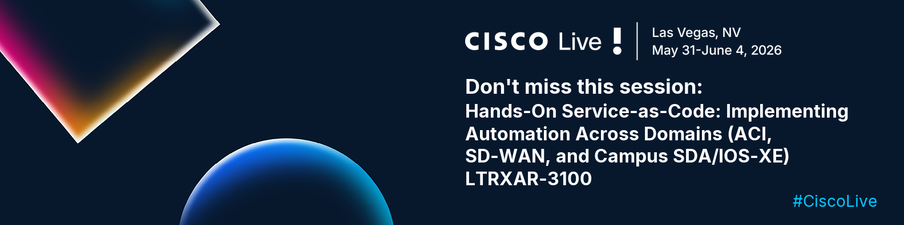
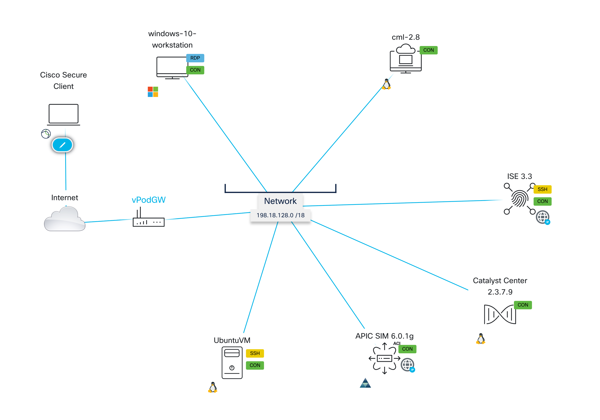
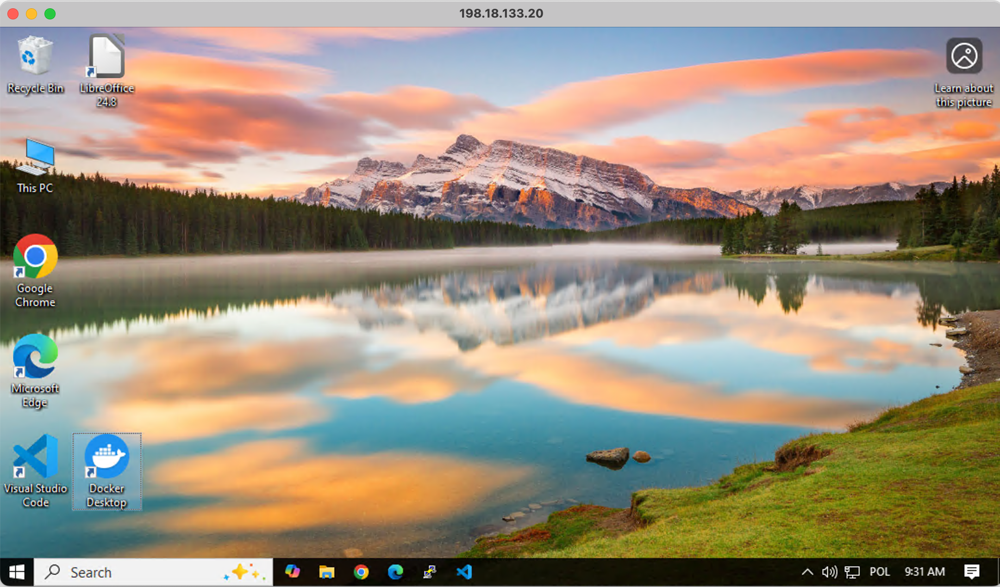

# Overview

## Learning Objectives

This lab gives you hands-on experience implementing the **Net-as-Code** methodology across three Cisco controller domains. Using a declarative, YAML-based source of truth stored in Git, you will build and run an automation pipeline that drives configuration through domain-specific Terraform adapters.

After completing this lab, you will be able to:

- Understand the Net-as-Code data model and how it separates intent (data) from execution logic (Terraform)
- Use the ACI as Code Terraform module to configure ACI tenants, policies, and L3Outs
- Use the SD-WAN as Code Terraform module to deploy feature templates to SD-WAN edges
- Use the Catalyst Center as Code Terraform module to provision SDA fabric sites, VNs, and anycast gateways
- Use the ISE as Code Terraform module to configure TrustSec SGTs, SGACLs, and the policy matrix
- Understand how a CI/CD pipeline (GitLab CI) orchestrates schema validation, planning, and deployment across all domains

## Disclaimer

Although the lab design and configuration examples can be used as a reference, for design-related questions please contact your Cisco representative or a Cisco partner.

The lab environment is fully virtualized. All components run in virtual form factor — including the APIC simulator, Catalyst Center, ISE, and network devices simulated in Cisco Modeling Lab (CML).

## Lab Overview

The management subnet used throughout this lab is **198.18.128.0/18**. All components have a management IP assigned from this subnet.

| Device | Management IP | Username | Password |
|---|---|---|---|
| Catalyst Center 2.3.7.9 | 198.18.129.100 | `admin` | `C1sco12345` |
| ISE 3.3 | 198.18.133.30 | `admin` | `C1sco12345` |
| APIC Simulator 6.0.1g | 198.18.133.200 | `admin` | `C1sco12345` |
| SD-WAN Manager 20.15.1 | 198.18.185.11 | `admin` | `C1sco12345` |
| Cisco Modeling Lab 2.8 | 198.18.128.27 | `admin` | `C1sco12345` |
| Windows 10 Workstation | 198.18.133.10 | `admin` | `C1sco12345` |
| GitLab (web) | 198.18.128.50 | `labuser` | `C1sco12345` |

### CML Topology

The Cisco Modeling Lab environment hosts the following virtual network devices:

| Device | Role | Version |
|---|---|---|
| SD-WAN Manager | vManage | 20.15.1 |
| SD-WAN Validator | vBond | 20.15.1 |
| SD-WAN Controller | vSmart | 20.15.1 |
| SD-WAN Edge 1–3 | cEdge | 20.15.1 |
| Catalyst 9000 Switch 1–3 | SDA Fabric | IOS-XE |

## Lab Access

!!! important
    Each workstation has a unique dCloud **Session ID** and **VPN credentials**. You will have to VPN to your virtual lab in order to access all the components of the lab environment.

**Step 1 — Connect to your dCloud Session via VPN**

Using the **Instructor-Led Lab Assistant**, establish a VPN connection to your assigned dCloud Session. If you do not know your dCloud Session ID, contact your proctor.

**Step 2 — RDP to the Windows Workstation**

From your local machine, open a Remote Desktop Protocol (RDP) session to the Windows VM:

- **IP:** `198.18.133.10`
- **Username:** `admin`
- **Password:** `C1sco12345`

The Windows VM serves as your jump station for all subsequent steps. Visual Studio Code, Git, Terraform, and a browser are pre-installed and pre-configured.

Confirm that the RDP session opens successfully before proceeding.

!!! important
    Once you log into the RDP session, open the Chrome browser and navigate to https://198.18.128.27 (or click on the CML bookmark on the browser) to access the Cisco Modeling Lab. Log in using the following credentials:

    | Device Name | URL | Username | Password |
    |---|---|---|---|
    | *Cisco Modeling Lab* | [https://198.18.128.27](https://198.18.128.27) | `admin` | `C1sco12345` |

    If the CML lab is not powered in, click on the triangle icon to power it on. By the time you start pushing the configuration to the CML lab, it will be powered on.

## Getting Started

If you are not aware of it, as an option, read through the [Introduction](introduction.md) to understand the Net-as-Code methodology before starting the labs. Additional documentation is available on the [Net-as-Code website](https://netascode.cisco.com/).

The labs are designed to be completed in order:

1. **Lab 1 — ACI as Code** — Start here to learn the data model pattern
2. **Lab 2 — SD-WAN as Code** — Apply the same pattern to SD-WAN feature templates
3. **Lab 3 — Catalyst Center as Code** — Extend to SDA fabric provisioning
4. **Lab 4 — ISE as Code** — Configure TrustSec policy
5. **Lab 5 — Multi-Domain Integration** — Run the unified cross-domain pipeline

Each lab repository is publicly available on GitHub. You will clone the public repository to your workstation as we progress in the labs. Explore the code, then push it to the GitLab instance in the lab environment where the CI/CD pipeline will deploy the configuration automatically.
